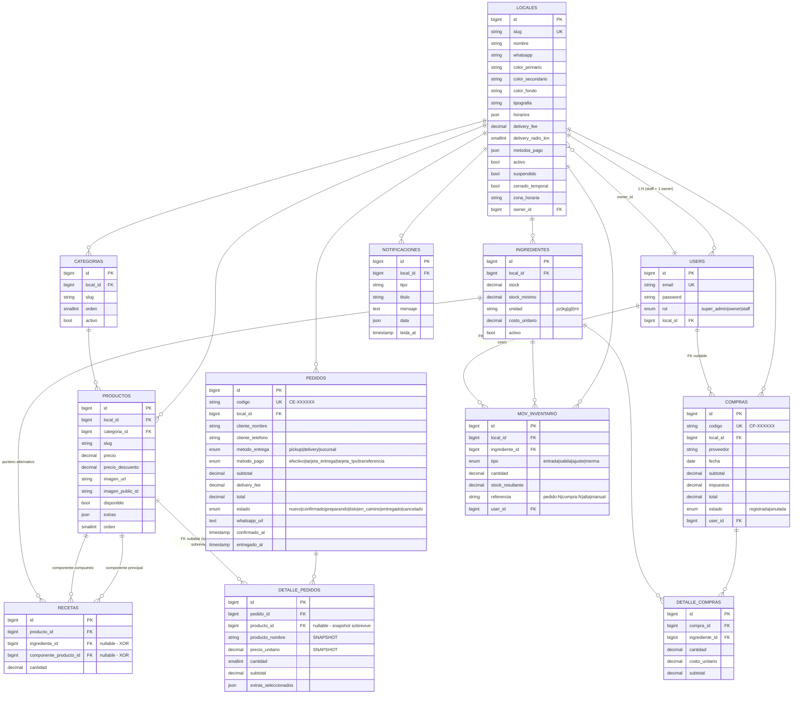

# Base de datos — ERD

> Diagrama mermaid renderizable + ASCII complementario. GitHub y la mayoría de viewers Markdown modernos renderean el `mermaid` automáticamente.

## Mermaid (renderizado)



> El diagrama mermaid arriba muestra estructura + cardinalidades + columnas clave. El bloque ASCII abajo es la versión "text-only" tradicional, conservada para terminal-friendly y diff legible.

## ASCII (terminal-friendly)


```
                        ┌──────────────────┐
                        │     locales      │ ◄── (tenant raíz)
                        │ id, slug UNIQ    │
                        │ branding, redes  │
                        │ delivery_fee/km  │
                        │ horarios JSON    │
                        │ cerrado_temporal │
                        │ owner_id ─────────┐
                        └────────┬─────────┘│
                                 │ 1:N      │
       ┌─────────────────────────┼──────────┼─────────────────────────┐
       │                         │          │                         │
       ▼                         ▼          ▼                         ▼
┌──────────────┐   ┌─────────────────┐  ┌──────────┐         ┌────────────────┐
│  categorias  │   │ ingredientes    │  │  users   │         │   pedidos      │
│ id, local_id │   │ id, local_id    │  │ id       │         │ id, local_id    │
│ slug, orden  │   │ stock, unidad   │  │ email    │         │ codigo UNIQ     │
└──────┬───────┘   │ costo_unitario  │  │ rol enum │         │ cliente_* (text)│
       │ 1:N       └──────┬──────────┘  │ local_id │         │ estado enum     │
       ▼                  │ 1:N         └──────────┘         │ whatsapp_url    │
┌──────────────┐          │                                  └────────┬────────┘
│  productos    │         │                                            │ 1:N
│ id, local_id  │         │                                            ▼
│ categoria_id  │◄────────┘                              ┌─────────────────────┐
│ slug, precio  │      ┌─────────────────┐                │  detalle_pedidos    │
│ extras JSON   │      │ mov_inventario  │                │ id, pedido_id       │
│ disponible    │      │ id, local_id    │                │ producto_id (null)  │
│ imagen_*      │      │ ingrediente_id  │                │ producto_nombre*    │
└──────┬───────┘      │ tipo enum       │                │ precio_unitario*    │
       │ 1:N          │ cantidad +/-     │                │ cantidad, subtotal  │
       ▼              │ stock_resultante│                │ extras_sel JSON     │
┌──────────────┐      │ referencia      │                └─────────────────────┘
│   recetas    │      │ user_id (null)  │
│ producto_id  │      └──────────────────┘                  * = snapshot
│ ingrediente_id (null)
│ componente_producto_id (null) ──► productos.id
│ cantidad
└──────────────┘
                                                          ┌──────────────────┐
                                                          │  notificaciones  │
                                                          │ id, local_id     │
                                                          │ tipo, titulo     │
                                                          │ data JSON        │
                                                          │ leida_at         │
                                                          └──────────────────┘

  ┌──────────────┐                ┌────────────────────┐
  │   compras    │                │  detalle_compras   │
  │ id, codigo   │ 1:N            │ compra_id          │
  │ local_id     │ ─────────────► │ ingrediente_id     │
  │ proveedor    │                │ cantidad           │
  │ fecha,estado │                │ costo_unitario     │
  │ user_id      │                │ subtotal           │
  └──────────────┘                └────────────────────┘
```

## Cardinalidades

- `locales 1:N users` (un local puede tener varios staff, **un solo owner** por convención).
- `locales 1:N categorias 1:N productos`.
- `productos M:N ingredientes` vía `recetas`. Una receta puede apuntar a otro **producto** (componente compuesto) en vez de a un ingrediente.
- `locales 1:N pedidos 1:N detalle_pedidos`.
- `productos 0:N detalle_pedidos` (la FK puede quedar NULL si el producto se borra — el detalle sobrevive por el snapshot).
- `locales 1:N ingredientes 1:N movimientos_inventario`.
- `locales 1:N compras 1:N detalle_compras`. Cada `detalle_compra` apunta a un ingrediente.
- `locales 1:N notificaciones`.

## Patrón "snapshot"

`detalle_pedidos` guarda `producto_nombre` y `precio_unitario` aunque el `producto_id` exista. Razón: los productos pueden renombrarse, subir precio o eliminarse — el histórico de pedidos no debe romperse. Ver [`features/pedidos.md`](../features/pedidos.md).

## Patrón "referencia textual"

`movimientos_inventario.referencia` es un string que codifica el origen del movimiento:

| Valor                              | Significado                          |
|-----------------------------------|--------------------------------------|
| `pedido:N`                         | Salida automática por pedido N        |
| `pedido:N:reintegro`               | Entrada por cancelación del pedido N  |
| `compra:N`                         | Entrada por compra N                  |
| `compra:N:anulacion`               | Salida por anulación de compra N      |
| `alta`                             | Stock inicial al crear el ingrediente |
| `manual`                           | Ajuste/merma/entrada manual           |

Este patrón evita una tabla polimórfica + permite queries `WHERE referencia LIKE 'pedido:%'`. Idempotencia (ej. evitar reintegros duplicados) verifica existencia de la `referencia` específica.
