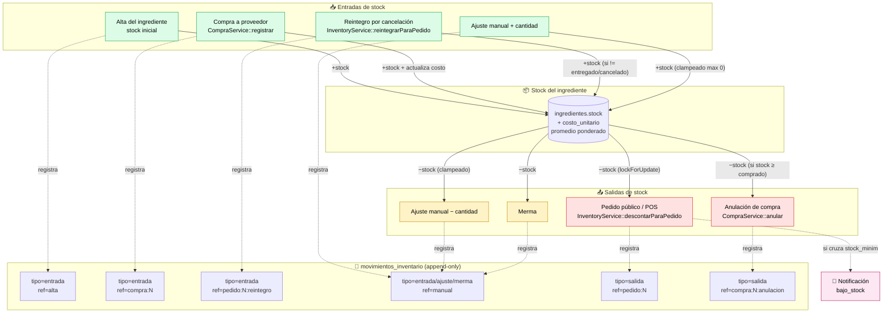

# Feature — Inventario

## Modelo

```
ingredientes (stock, stock_minimo, unidad, costo_unitario)
      ▲
      │
movimientos_inventario (tipo, cantidad, stock_resultante, referencia)
```

Cada cambio de stock se acompaña de **una fila en `movimientos_inventario`**. Eso permite reconstruir el historial, calcular movimientos por periodo y mantener auditoría.

## Diagrama de flujo del stock



**Lo importante**:
- Todo cambio escribe **exactamente una fila** en `movimientos_inventario` con `stock_resultante` capturado.
- El reintegro (E3) es **idempotente** vía la referencia `pedido:N:reintegro` — no se duplica si se cancela dos veces.
- La anulación de compra (S2) puede **fallar con 409** si parte del stock ya se consumió — el sistema valida antes de revertir.
- Las notificaciones de `bajo_stock` se generan sólo cuando se **cruza** el umbral (no spam).

## Tipos de movimiento

| tipo       | cantidad | Contexto                                                           |
|-----------|----------|-------------------------------------------------------------------|
| `entrada`  | positiva | Stock inicial al alta del ingrediente. Compra a proveedor. Reintegro por cancelación de pedido. |
| `salida`   | positiva | Descuento automático por pedido. Anulación de compra (sale lo entrado). |
| `ajuste`   | +/-      | Conteo físico, corrige diferencias.                                |
| `merma`    | -        | Daño / vencimiento / desperdicio. (Aceptado positivo por validación, pero se entiende como "lo que se perdió".) |

## Referencia textual

Codifica el origen del movimiento en string. Patrones:

| Valor                       | Origen                                |
|----------------------------|---------------------------------------|
| `alta`                      | Stock inicial (al crear ingrediente)   |
| `manual`                    | Ajuste/merma desde panel              |
| `pedido:N`                  | Descuento al recibir pedido N          |
| `pedido:N:reintegro`        | Sumar al cancelar pedido N             |
| `compra:N`                  | Subir por compra registrada            |
| `compra:N:anulacion`        | Bajar por anulación de compra          |

Esto evita una tabla polimórfica y permite queries `WHERE referencia LIKE 'pedido:%'`.

## Descuento al recibir pedido

`App\Services\Inventory\InventoryService::descontarParaPedido`. Reglas:

1. **Debe correr dentro de `DB::transaction`** — fail con `LogicException` si no.
2. Calcula consumo: expande la receta de cada producto del pedido recursivamente:
   - Si la fila de receta apunta a un `ingrediente_id` → suma cantidad × multiplicador al ingrediente.
   - Si apunta a `componente_producto_id` → expande recursivamente con multiplicador acumulado.
   - **Detecta ciclos** vía `$visitados` (no permite A→B→A).
   - Producto sin receta → no consume nada (válido).
3. `lockForUpdate` sobre los ingredientes (sólo MySQL — sqlite ignora).
4. Pre-valida stock vs requerido. Si falta algo → lanza `InsufficientStockException(faltantes)` → ROLLBACK.
5. Baja stock, guarda, crea `MovimientoInventario` con `tipo=salida` y `referencia=pedido:N`.
6. Si `stockAntes > stock_minimo && nuevoStock <= stock_minimo` → crea `Notificacion('bajo_stock')` (deduplicada — no spamea si ya hay una pendiente).

## Reintegro al cancelar pedido

`InventoryService::reintegrarParaPedido`:

1. Debe correr dentro de transacción.
2. **Idempotencia**: si ya existe `MovimientoInventario where referencia='pedido:N:reintegro'` → return sin hacer nada.
3. Lee todas las salidas con `referencia='pedido:N' AND tipo='salida'`. Agrupa por ingrediente. Suma cantidades.
4. `lockForUpdate`, sube stock, registra movimiento de `entrada` con `referencia='pedido:N:reintegro'`.

## Ajustes manuales

`POST /api/v1/ingredientes/{id}/ajuste`:
- Body: `{ tipo, cantidad, motivo }`.
- `cantidad != 0` (validado en `AjusteStockRequest`).
- Para `merma`/`ajuste`, la cantidad puede ser negativa (resta del stock).
- Resultado clampeado a `max(0, stock + cantidad)` — el stock nunca queda negativo.
- Registra `MovimientoInventario` con `referencia='manual'`, `user_id` del actor.

## Historial

`GET /api/v1/ingredientes/{id}/movimientos`:
- Paginado (max 100/pp).
- Filtros: `?tipo=&desde=&hasta=`.
- Ordenado `created_at DESC, id DESC`.
- Carga `usuario:id,nombre,email` para mostrar quién hizo el cambio.

## Notificaciones de bajo stock

Se crean automáticamente en `descontarParaPedido` cuando un ingrediente **cruza** el umbral (no cuando ya estaba por debajo). Evita spam: chequea si existe una notificación no leída para ese `ingrediente_id` antes de crear otra.

```json
{
  "tipo":"bajo_stock",
  "titulo":"Bajo stock: Tortilla",
  "mensaje":"Quedan 8 pz de Tortilla (mínimo: 10).",
  "data":{ "ingrediente_id": 7, "stock": 8, "stock_minimo": 10, "unidad": "pz" }
}
```

## Métricas de inventario

`MetricasService::calcular` incluye `bajo_stock` (count actual de ingredientes con `stock <= stock_minimo`). El número va en `resumen.bajo_stock`.

## Endpoints

Ver [`api/tenant.md`](../api/tenant.md#ingredientes--apiresource--ajustes).

## Casos límite y consideraciones

- **`lockForUpdate`** solo aplica en MySQL. En sqlite (tests) los locks no funcionan, pero el descuento es secuencial dentro de la transacción → suficiente para tests.
- **Stock fraccional**: `decimal(12,3)` permite hasta 9 decimales después del punto (3 decimales reales). Pensado para `kg` y `l` con 3 decimales.
- **Borrar un ingrediente con recetas**: el controller bloquea (409). Si quieres borrarlo, primero quita las recetas que lo referencian.
- **Borrar un ingrediente sin recetas**: cascadea `movimientos_inventario` y `detalle_compras` (pierdes el histórico). En la práctica casi nunca conviene; usa `activo=false`.
