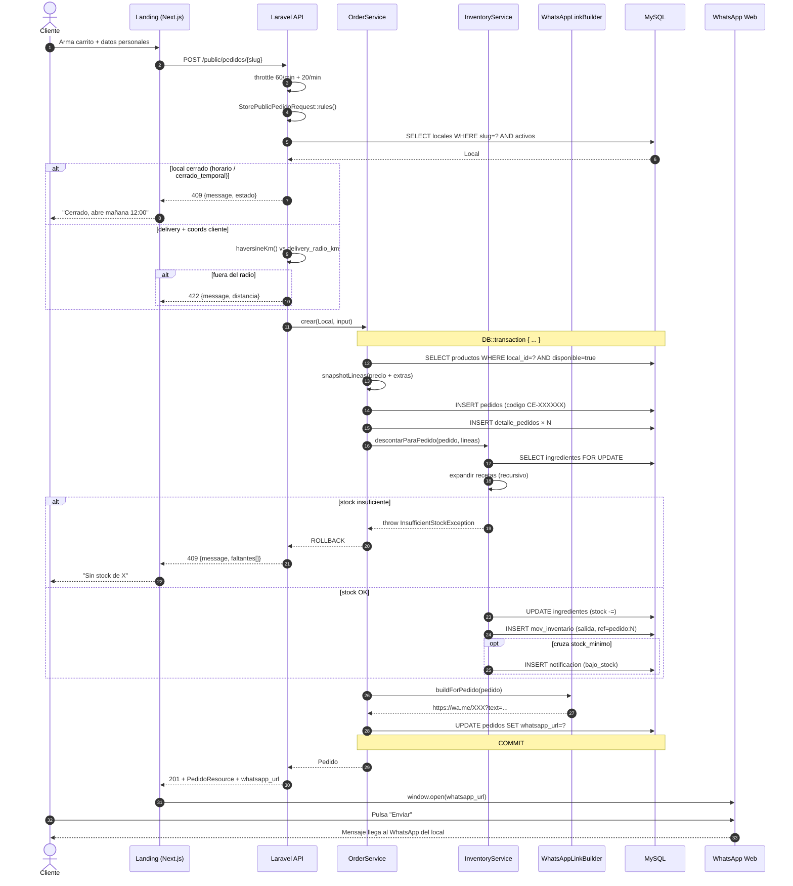
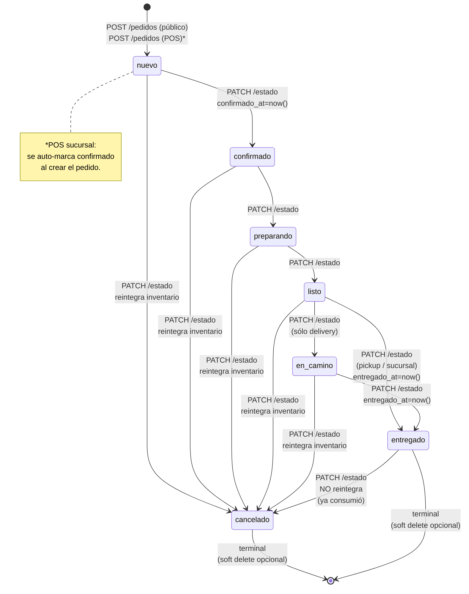

# Feature — Pedidos

## Resumen

Un pedido nace por uno de dos caminos:

1. **Público**: cliente anónimo desde la landing del local (`POST /public/pedidos/{slug}`). Genera URL `wa.me/...` para confirmar.
2. **Interno (POS)**: owner/staff registra venta presencial (`POST /pedidos`). No genera URL WhatsApp; se auto-confirma si es `sucursal`.

Ambos atraviesan `App\Services\Orders\OrderService::crear()`.

## Diagrama del flujo público



### Versión ASCII (alternativa para terminal)

```
Cliente en landing
   │
   │  POST /public/pedidos/{slug} { cliente, metodo_entrega, metodo_pago, items[] }
   ▼
Throttle 60/min global + 20/min específico
   ▼
StorePublicPedidoRequest::rules()  → 422 si payload inválido
   ▼
PublicPedidoController::store($req, $slug)
   ├── Local::activos()->bySlug($slug)->first()      → 404 si falla
   ├── HorarioCalculator::estado($local)
   │     └── { abierto, mensaje, ... }
   │     └── si abierto === false → 409 { message, estado }
   ├── Si delivery + coords cliente → haversineKm()
   │     └── si > delivery_radio_km → 422 { message }
   │
   ▼
OrderService::crear($local, $input)
   ├── Carga productos del local (withoutTenantScope + where local_id + disponible:true)
   │     └── si missing → RuntimeException → 500 (debería ser 422 — pendiente)
   ├── Snapshot lineas + subtotal
   │     └── precio_unitario = producto.precio + Σ extras[].price
   │     └── subtotal_linea  = precio_unitario × cantidad
   ├── deliveryFee = (entrega == 'delivery') ? local.delivery_fee : 0
   ├── total       = subtotal + deliveryFee
   │
   ▼
DB::transaction(
   ├── Pedido::create(...)              // dispara codigo CE-XXXXXX en booted()
   ├── DetallePedido::create xN
   ├── InventoryService::descontarParaPedido($pedido, [{producto_id, cantidad}])
   │     ├── lockForUpdate sobre ingredientes
   │     ├── calcula consumo recursivamente (expande componentes)
   │     ├── valida stock ≥ requerido
   │     │     └── si no → throw InsufficientStockException → ROLLBACK → 409
   │     ├── baja stock + crea MovimientoInventario('salida', ref=pedido:N)
   │     └── si cruza stock_minimo → Notificacion::create('bajo_stock')
   └── if entrega !== 'sucursal':
         $pedido->whatsapp_url = WhatsAppLinkBuilder::buildForPedido($pedido)
)
   ▼
return 201 con PedidoResource + additional({whatsapp_url})
   ▼
Cliente abre URL wa.me → mensaje pre-armado a WhatsApp del local
```

## Snapshot de precios

`detalle_pedidos` guarda `producto_nombre`, `precio_unitario`, `extras_seleccionados` en el momento del pedido. **No se recalcula** cuando se sirve el detalle después. Razón: el owner puede subir precio, renombrar productos o eliminarlos — el histórico no debe romperse.

`detalle_pedidos.producto_id` queda NULL si el producto se borra (FK con `nullOnDelete`).

## Máquina de estados



**Reglas críticas** del flujo:

1. Reintegro al cancelar es **idempotente**: si se cancela dos veces, no duplica (chequea referencia `pedido:N:reintegro`).
2. Cancelar desde `entregado` **no reintegra** (el cliente ya consumió).
3. `confirmado_at` / `entregado_at` se llenan automáticamente al pasar a esos estados.
4. **No hay matriz de transiciones válidas enforced** — un owner puede saltar de `nuevo` a `entregado` directamente. La validación del FormRequest sólo limita el set del enum, no las transiciones. Pendiente si el negocio lo exige.

### Versión ASCII

```
                            ┌─────────────┐
                            │   nuevo     │ ← creado siempre así
                            └──────┬──────┘
                                   │ confirmar
                                   ▼
                            ┌─────────────┐    confirmado_at = now()
                            │ confirmado  │
                            └──────┬──────┘
                                   │
                                   ▼
                            ┌─────────────┐
                            │ preparando  │
                            └──────┬──────┘
                                   │
                                   ▼
                            ┌─────────────┐
                            │    listo    │
                            └──────┬──────┘
                                   │
                            (pickup/sucursal)         (delivery)
                                   │                       │
                                   ▼                       ▼
                            ┌─────────────┐         ┌─────────────┐
                            │ entregado   │ ◄────── │ en_camino   │
                            └─────────────┘         └─────────────┘
                                       entregado_at = now()


  Desde casi cualquier estado activo puede ir a:
                            ┌─────────────┐
                            │ cancelado   │ → reintegra inventario (si no era ya cancelado/entregado)
                            └─────────────┘
```

**Implementación:** la validación de transiciones la hace sólo el enum del FormRequest (`in:nuevo,confirmado,...`). **No hay matriz de transiciones válidas** — un owner podría pasar de `nuevo` directo a `entregado`. Pendiente: implementar transitions table si el negocio lo exige.

## Timestamps automáticos (`PedidoController::updateEstado`)

- `confirmado` y `confirmado_at == null` → llena `now()`.
- `entregado` y `entregado_at == null` → llena `now()`.

Se ejecuta dentro de `DB::transaction` porque también puede invocar `InventoryService::reintegrarParaPedido()`.

## Re-stock al cancelar (idempotente)

Cuando `nuevo_estado=cancelado` Y el estado anterior NO era `cancelado` ni `entregado`:
- Lee `movimientos_inventario` con `referencia = pedido:N AND tipo=salida`.
- Suma por ingrediente.
- Sube stock + crea `movimientos_inventario` con `referencia = pedido:N:reintegro`.
- Si esa referencia ya existe → no hace nada (idempotencia).

No re-integra si:
- Estado anterior ya era `cancelado` (idempotencia).
- Estado anterior era `entregado` (el cliente ya consumió de facto).

## Errores típicos

| Caso                                   | HTTP | Cuerpo                                  |
|---------------------------------------|------|-----------------------------------------|
| Local no existe o inactivo             | 404  | `{ message: "Local no encontrado..." }` |
| Local cerrado                          | 409  | `{ message, estado }`                   |
| Stock insuficiente                     | 409  | `{ message, faltantes:[...] }`          |
| Fuera de radio                         | 422  | `{ message }`                           |
| Payload inválido                       | 422  | `{ message, errors }`                   |
| Producto no del local o no disponible  | 500  | (genérico; mejorable a 422)             |

## Diferencias público vs interno

| Aspecto                    | Público (`POST /public/pedidos/{slug}`) | Interno (`POST /pedidos`) |
|---------------------------|------------------------------------------|-------------------------|
| Auth                       | No                                       | Sí (`sanctum + tenant`) |
| Cliente                    | Requerido (`cliente.nombre`, `cliente.telefono`) | Opcional (default `Mostrador` / `-`) |
| Entregas válidas           | `pickup`, `delivery`                     | `pickup`, `delivery`, `sucursal` |
| Pagos válidos              | `efectivo`, `tarjeta_entrega`, `transferencia` | + `tarjeta_tpv`         |
| Genera `whatsapp_url`?     | Sí                                       | No (excepto si no es `sucursal`) |
| Auto-confirmado?           | No                                       | Sí, si `metodo_entrega=sucursal` |
| Cierra automáticamente?    | No                                       | No (cambio manual via PATCH) |
| Throttle                   | 20/min                                   | 60/min global             |
| Valida horario?            | Sí                                       | No (puede vender fuera de horario) |
| Valida radio?              | Sí (si delivery + coords)               | No                        |

Ver [`features/pos.md`](pos.md) para el interno.

## Listas y filtros (`GET /pedidos`)

- `?estado=` enum
- `?per_page=` (max 100)
- Default: `orderByDesc('id')`.
- Carga `with('detalles')` siempre.

## Soft delete

`DELETE /pedidos/{id}` hace soft-delete. **No reintegra inventario** automáticamente (un pedido borrado es ruido, no una cancelación). Si quieres reintegrar primero, cambiar a `cancelado` y luego borrar.
